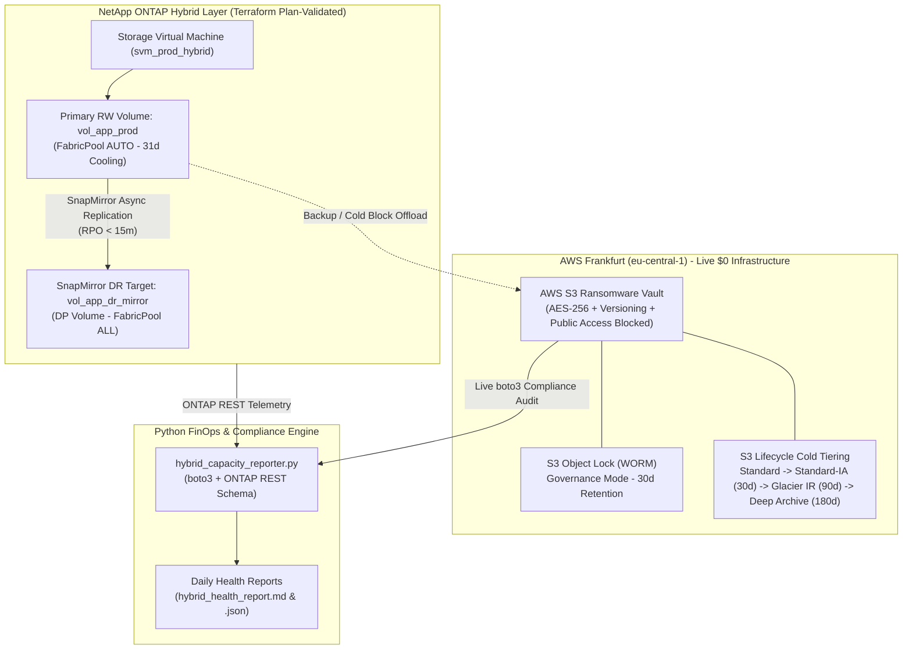

# Hybrid Cloud Storage & Ransomware Vault - Architecture

```mermaid
flowchart TB
    subgraph OnPrem_or_FSx["NetApp ONTAP Hybrid Layer (Terraform Plan-Validated)"]
        SVM["Storage Virtual Machine (svm_prod_hybrid)"]
        VolProd["Primary RW Volume: vol_app_prod\n(FabricPool AUTO - 31d Cooling)"]
        VolDR["SnapMirror DR Target: vol_app_dr_mirror\n(DP Volume - FabricPool ALL)"]
        SVM --> VolProd
        VolProd -- "SnapMirror Async Replication\n(RPO < 15m)" --> VolDR
    end

    subgraph AWS_FreeTier["AWS Frankfurt (eu-central-1) - Live $0 Infrastructure"]
        S3Vault["AWS S3 Ransomware Vault\n(AES-256 + Versioning + Public Access Blocked)"]
        WORM["S3 Object Lock (WORM)\nGovernance Mode - 30d Retention"]
        Lifecycle["S3 Lifecycle Cold Tiering\nStandard -> Standard-IA (30d) -> Glacier IR (90d) -> Deep Archive (180d)"]
        S3Vault --- WORM
        S3Vault --- Lifecycle
    end

    subgraph FinOps_Automation["Python FinOps & Compliance Engine"]
        PyScript["hybrid_capacity_reporter.py\n(boto3 + ONTAP REST Schema)"]
        Reports["Daily Health Reports\n(hybrid_health_report.md & .json)"]
        PyScript --> Reports
    end

    VolProd -. "Backup / Cold Block Offload" .-> S3Vault
    S3Vault -- "Live boto3 Compliance Audit" --> PyScript
    OnPrem_or_FSx -- "ONTAP REST Telemetry" --> PyScript
```
